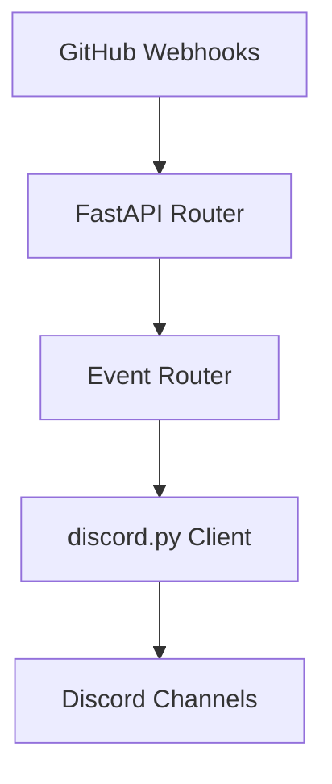

# Discord-Github

FastAPI-based webhook router that forwards GitHub events to Discord channels.
This guide covers basic setup while the [project wiki](https://github.com/your-org/Discord-Github/wiki) contains advanced usage notes.

## Architecture Overview



Webhook events arrive via FastAPI, are classified by the router and then sent to
specific Discord channels using the bot client. See `AGENTS.md` for the detailed
channel map.

### Discord Channel Routing

The router selects a destination channel based on the GitHub event type. Common
examples include:

- Push events → `settings.channel_commits`
- Pull request merges → `settings.channel_code_merges`
- Other pull request actions → `settings.channel_pull_requests`
- Unhandled events → `settings.channel_bot_logs`

## How to Re-run the Webhook Script

To re-run the webhook script `add_all_webhooks.py` when new repositories are created, follow these steps:

1. Ensure your `.env` file is correctly configured with the following variables:
   - `GITHUB_TOKEN`: Your GitHub personal access token with repository access.
   - `GITHUB_WEBHOOK_SECRET`: The secret for verifying webhooks.
   - `GITHUB_USERNAME`: Your GitHub username.
   - `WEBHOOK_URL`: The URL for the webhook destination (e.g., your service endpoint).

2. Run the script using:
   ```bash
   python add_all_webhooks.py
   ```

This will add the necessary webhooks to all repositories associated with your GitHub account.

### Automated Weekly Execution

The repository includes a GitHub Actions workflow that automatically runs the webhook script every Sunday at 2 AM UTC to ensure all repositories have the required webhooks.

**To enable the automated workflow:**

1. Set up the following repository secrets in your GitHub repository settings:
   - Go to your repository → Settings → Secrets and variables → Actions
   - Click "New repository secret" for each of the following:
     - `GITHUB_TOKEN`: Your GitHub personal access token (with repo permissions)
     - `GITHUB_WEBHOOK_SECRET`: The secret for webhook verification
     - `GITHUB_USERNAME`: Your GitHub username
     - `WEBHOOK_URL`: The URL for the webhook destination (e.g., `http://65.21.253.0:8000/github`)

2. The workflow will automatically run weekly, or you can trigger it manually from the Actions tab.

3. If the workflow fails, it will automatically create an issue in the repository for investigation.

## Setup

1. Copy `.env.template` to `.env` and add your configuration:
   ```bash
   cp .env.template .env
   ```
2. Install dependencies:
   ```bash
   pip install -r requirements.txt
   ```
3. Run the bot directly:
   ```bash
   python run.py
   ```
4. Or start it with Docker Compose:
   ```bash
   docker-compose up --build -d
   ```

## Available Routes

- `POST /github` – receive GitHub webhook events.
- `GET /health` – simple health check returning `{"status": "ok"}`.

### Environment Variables

Create a `.env` file from `.env.template` and adjust the values for your server.
The table below summarizes the available settings.

| Variable | Description |
| --- | --- |
| `DISCORD_BOT_TOKEN` | Discord bot authentication token |
| `DISCORD_WEBHOOK_URL` | Default Discord webhook URL |
| `GITHUB_WEBHOOK_SECRET` | Secret used to verify GitHub payloads |
| `GITHUB_TOKEN` | Token for GitHub API requests |
| `GITHUB_USERNAME` | GitHub username for API calls |
| `WEBHOOK_URL` | Public URL of the `/github` endpoint |
| `HOST` | Address the server binds to |
| `PORT` | Port the server listens on |
| `CHANNEL_COMMITS` | Channel for commit notifications |
| `CHANNEL_PULL_REQUESTS` | Channel for pull request events |
| `CHANNEL_CODE_MERGES` | Channel for merged PRs |
| `CHANNEL_ISSUES` | Channel for issue events |
| `CHANNEL_RELEASES` | Channel for release events |
| `CHANNEL_DEPLOYMENT_STATUS` | Channel for deployment status |
| `CHANNEL_GOLLUM` | Channel for wiki updates |
| `CHANNEL_BOT_LOGS` | Fallback log channel |
| `CHANNEL_COMMITS_OVERVIEW` | Optional commit summary channel |
| `CHANNEL_PULL_REQUESTS_OVERVIEW` | Optional PR summary channel |
| `CHANNEL_MERGES_OVERVIEW` | Optional merge summary channel |


## Pull Request Message Cleanup

When a pull request is opened or marked ready for review, the bot records the Discord message ID in `pr_message_map.json`.
Once the pull request is closed (merged or not), the stored message is automatically deleted from the `#pull-requests` channel.
The JSON file maps `repo_name#pr_number` to the associated Discord message ID and is created at runtime in the project root.


## Message Retention

Old messages can clutter channels. The bot automatically removes messages older than `MESSAGE_RETENTION_DAYS` from the commits, pull requests and releases channels during startup. Set this environment variable to control the retention period (default is 30 days).


The utility script `cleanup_pr_messages.py` can remove stale entries if events were missed. It loads `pr_message_map.json`, checks each pull request's state via the GitHub API, deletes the corresponding Discord message when the PR is closed or merged, and updates the file.
This cleanup runs automatically on bot startup but can also be invoked manually:

```bash
python cleanup_pr_messages.py
```


The helper function `cleanup_pr_messages` checks this file on startup. It uses the GitHub API
to determine if the referenced pull requests are already closed and, if so, deletes the
corresponding messages from Discord before removing the entries from the JSON map. This
self-healing step ensures stale PR notifications are removed even if the bot was offline
when the pull request closed. The cleanup routine requires a valid `GITHUB_TOKEN` so the bot
can query pull request status.


## Retroactive PR Cleanup

If the bot missed deleting pull request messages (for example, it was offline when a PR was closed), you can remove outdated messages manually:

```bash
python pr_cleanup_tool.py
```

This script checks each entry in `pr_message_map.json`, queries the GitHub API to see if the PR is closed, and deletes the corresponding Discord message from the `#pull-requests` channel.

## Clearing Development Channels

To quickly remove **all** messages from the development channels, type:

```bash
!clear
```

The command iterates over the configured development channels and purges every message, providing a clean slate for testing.

## Discord Bot Commands

The bot provides a few convenience commands when interacting directly in Discord.

- `!update` &ndash; Fetch all open pull requests across your repositories and repost them in the pull-requests channel. This is useful if the bot was offline when events occurred.
- `!clear` &ndash; Remove **all** messages from the main development channels (commits, pull requests, releases, CI builds and code merges).


## Discord Commands

The bot provides a few text commands directly in Discord. Run `!update` to
manually post embeds for all currently open pull requests across your
repositories. The command queries the GitHub API using your configured token and
username, then formats each pull request using the same embed style as webhook
events.

## Running Tests

Install development dependencies and execute the test suite with `pytest`:

```bash
pip install -r requirements.txt
pytest
```

You can also run the tests inside the Docker container:

```bash
docker-compose run --rm discord-github-bot pytest
```

